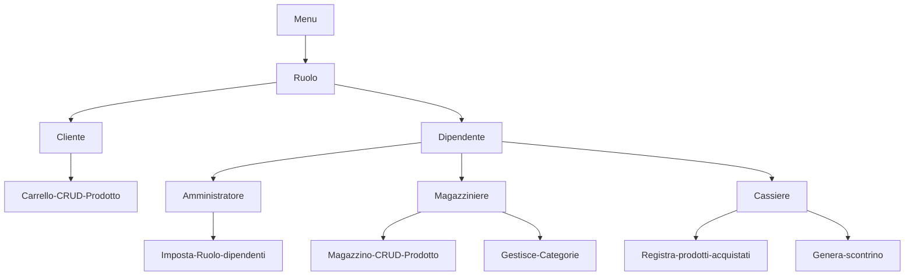

# SUPERMERCATO ADVANCED

Implementare le entità che compongono il supermercato.

> Partendo dalla soluzione dell'esercizio `28_classi-9` implementare le seguenti entità:
- **Dipendente**: rappresenta un dipendente del supermercato.

> Oltre ai campi già presenti (ID,nome,cognome), aggiugere un campo `ruolo` di tipo `String` che rappresenta il ruolo del dipendente (es."cassiere","magazziniere","direttore",ecc.). Implementare i metodi `getRuolo` e `setRuolo`.

1. **Cassiere**: può registrare i prodotti acquistati da un cliente e calcolare il totale da pagare.
2. **Magazziniere**: può aggiungere o rimuovere prodotti dal magazzino.
3. **Amministratore**: rappresenta un amministratore del supermercato. Un amministratore è un dipendente con ruolo "amministratore".
Può impostare il ruolo dei dipendenti. Implementare il metodo `setRuolo` che accetta come parametri un dipendente e una stringa rappresentante il ruolo da assegnare al dipendente.

| Dipendente| Tipo di dato | Note
|-----------|-----------|-----------|
| ID | int | viene generato in automatico con un progressivo
| username | string | viene assegnato all'admin  
| ruolo | String | viene assegnato all'admin e può essere cassiere o magazziniere

|Cliente| Tipo di dato | Note 
|-----------|-----------|-----------|
| ID | int | viene generato in automatico con un progressivo
| username | string | ognuno decide come vuole farlo
| carrello | Prodotto[] | 
| storico acquisti | Purchases[] | viene popolato al termine di ogni acquisto
| percentuale_sconto | int | viene incrementata a seconda del valore dello storico degli acquuisti
| credito | double | 

|Prodotto| Tipo di dato | Note 
|-----------|-----------|-----------|
| ID | int | viene generato in automatico con un progressivo
| nome | string | viene inserito dal magazziniere
| prezzo | double | viene inserito dal magazziniere
| quantità | int | viene inserito dal magazziniere
| categoria | string | viene inserito dal magazziniere

|Categoria| Tipo di dato | Note 
|-----------|-----------|-----------|
| ID | int | viene generato in automatico con un progressivo
| nome | string | 

**Purchases è lo stato nel quale si trova l'acquisto di un cliente. Prima di essere passato alla cassa**
- Quando viene passato allo stato `completato` la cassa può processare lo scontrino.


|Purchases| Tipo di dato | Note 
|-----------|-----------|-----------|
| ID | int | viene generato in automatico con un progressivo
| cliente | Cliente | ognuno decide come vuole farlo
| prodotti | Prodotto[] | 
|quantità| int |
| data | Date | 
| stato | Bool |  Lo stato di un acquisto di default è `in corso` e può essere modificato dal cliente in `completato` o `annullato`

|Cassa| Tipo di dato | Note 
|-----------|-----------|-----------|
| ID | int | viene generato in automatico con un progressivo
| dipendente | Dipendente | ognuno decide come vuole farlo
| acquisti | Purchases[] | 
| scontrino_processato | Bool | di default è `false` e diventa `true` quando la cassa ha processato lo scontrino e può ricaricare il credito del cliente quando è finito

Ruoli:

|Cassiere|Magazziniere | Amministratore | Cliente 
|-----------|-----------|-----------|-----------|
| può registrare i prodotti acquistati da un cliente che ha degli acquisti in stato completato e calcolare il totale da pagare generando lo scontrino.| può visualizzare aggiungere modificare o rimuovere prodotti dal magazzino e può gestire le categorie. | può visualizzare ed impostare il ruolo dei dipendenti. | Può aggiungere o rimuovere prodotti e cambiare lo stato dell'ordine

# Grafico che rappresenta il programma del ciclo di vita del prodotto



# Task List

## Models
Prodotto
```csharp
public class Prodotto
{
    public int Id { get; set; } // Generato automaticamente
    public string Nome { get; set; } // Inserito dal magazziniere
    public decimal Prezzo { get; set; } // Inserito dal magazziniere
    public int Giacenza { get; set; } // Inserito dal magazziniere
    public string Categoria { get; set; } // Associato a una categoria esistente
}
```
Cliente
```csharp
public class Cliente
{
    public int id { get; set;}
    public string username { get; set; }
    public List<Prodotto> carrello { get; set; }
    public List<Purchases> storicoAcquisti { get; set; }
    public int percentualeSconto { get; set; }
    public double credito { get; set; }

} 
```
Dipendente
```csharp
public class Dipendente
{
    public int id { get; set; }
    public string username { get; set; }
    public string ruolo { get; set; }
}
```
Categoria
```csharp
public class Categoria
{
    public int id { get; set;}
    public string nome { get; set; }
}
```
Purchases
```csharp
public class Purchases
{
    public int id { get; set;}
    public Cliente cliente { get; set; }
    public List<Prodotto> prodotti { get; set; }
    public int giacenza { get; set; }
    public DateTime data { get; set; }
    public bool stato { get; set; }
}
```
Cassa
```csharp
public class Cassa
{
    public int id { get; set;}
    public Dipendente dipendente { get; set; }
    public List<Purchases> acquisti { get; set; }
    public bool scontrinoProcessato { get; set; }
}
```
## Managers
- [x] ProdottoManager
```csharp
public class ProdottoManager // (CRUD)
{
    private List<Prodotto> prodotti; // prodotti è private perchè non voglio che venga modificato dall'esterno
    // questo new è necessario affinche dal dominio privato la classe possa comunicare all'esterno i dati aggiornati
    // un modo per rendere pubblico un dato privato
    private int prossimoId;

    private ProdottoRepository repository;
    public ProdottoManager(List<Prodotto> Prodotti)
    {
        prodotti = Prodotti;
        repository = new ProdottoRepository();

        prossimoId = 1;

        foreach (var prodotto in prodotti)
        {
            if (prodotto.Id >= prossimoId)
            {
                prossimoId = prodotto.Id + 1;
            }
        }
    }

    // metodo per aggiungere un prodotto alla lista
    public void AggiungiProdotto(Prodotto prodotto)
    {
        prodotto.Id = prossimoId;
        prossimoId++;
        prodotti.Add(prodotto);
        Console.WriteLine($"Prodotto aggiunto con ID: {prodotto.Id}");
    }

    // metodo per visualizzare la lista di prodotti
    public List<Prodotto> OttieniProdotti()
    {
        return prodotti;
    }

    // Ogni campo utilizza il formato {Campo - Larghezza} dove:
    // Campo è il valore da stampare
    // Larghezza specifica la larghezza del campo; il segno - allinea il testo a sinistra.
    // {"Nome", -20} significa che il nome del prodotto avrà una larghezza fissa di 20 caratteri, allineato a sinistra
    // Formato dei numeri:
    // Per i pezzi, viene usato il formato 0.00 per mostrare sempre due cifre decimali
    // Linea separatrice:
    // La riga Console.WriteLine(new string('-', 50)); stampa una line divisoria lunga 50 caratteri per migliorare la lggibilità

    public void StampaProdottiIncolonnati()
    {
        // Intestazioni con larghezza fissa
        Console.WriteLine(
        $"{"ID",-5} {"Nome",-20} {"Prezzo",-10} {"Giacenza",-10} {"Categoria",-10}"
        );
        Console.WriteLine(new string('-', 50)); // Linea separatrice

        // Stampa ogni prodotto con larghezza fissa
        foreach (var prodotto in prodotti)
        {
            Console.WriteLine(
                $"{prodotto.Id,-5} {prodotto.Nome,-20} {prodotto.Prezzo,-10:0.00} {prodotto.Giacenza,-10} {prodotto.Categoria,-10}"
            );
        }
    }

    // metodo per cercare un prodotto
    public Prodotto TrovaProdotto(int id)
    {
        foreach (var prodotto in prodotti)
        {
            if (prodotto.Id == id)
            {
                return prodotto;
            }
        }
        return null;
    }
    // metodo per modificare un prodotto esistente
    public void AggiornaProdotto(int id, Prodotto nuovoProdotto)
    {
        var prodotto = TrovaProdotto(id);
        if (prodotto != null)
        {
            prodotto.Nome = nuovoProdotto.Nome;
            prodotto.Prezzo = nuovoProdotto.Prezzo;
            prodotto.Giacenza = nuovoProdotto.Giacenza;
            prodotto.Categoria = nuovoProdotto.Categoria;
        }
    }

    // metodo per eliminare un prodotto esistente
    public void EliminaProdotto(int id)
    {
        var prodotto = TrovaProdotto(id);
        if (prodotto != null)
        {
            prodotti.Remove(prodotto);
            // elimina il file JSON corrispondente al prodotto
            string filePath = Path.Combine("ProdottiJson", $"{prodotto.Id}.json");
            File.Delete(filePath);
            Console.WriteLine($"Prodotto eliminato: {filePath}");
        }
    }
}
```
- [ ] ClienteManager
```csharp
public class ClienteManager // (CRUD)
{
    private ClienteRepository repository;
    private int prossimoId;
    private List<Cliente> clienti;
    

    public ClienteManager(List<Cliente> Clienti)
    {
        clienti = Clienti;
        
        repository = new ClienteRepository();

        prossimoId = 1;

        foreach (var cliente in clienti)
        {
            if (cliente.id >= prossimoId)
            {
                prossimoId = cliente.id + 1;
            }
        }
    }


    public void AggiungiCliente(Cliente cliente)
    {
        cliente.id = prossimoId;
        prossimoId++;
        clienti.Add(cliente);
        Console.WriteLine($"Cliente aggiunto con ID: {cliente.id}");
    }

    
    public List<Cliente> OttieniClienti()
    {
        return clienti;
    }


    public void StampaClientiIncolonnati()
    {
        // Intestazioni con larghezza fissa
        Console.WriteLine(
        $"{"ID",-5} {"Username",-20} {"PercentualeSconto",-10} {"Credito",-10} "
        );
        Console.WriteLine(new string('-', 50)); // Linea separatrice

        // Stampa ogni prodotto con larghezza fissa
        foreach (var cliente in clienti)
        {
            Console.WriteLine(
                $"{cliente.id,-5} {cliente.username,-20} {cliente.percentualeSconto,-10:0.00} {cliente.credito,-10}" 
            );
        }
    }

    
    public Cliente TrovaCliente(int id)
    {
        foreach (var cliente in clienti)
        {
            if (cliente.id == id)
            {
                return cliente;
            }
        }
        return null;
    }
    
    /*public void AggiornaProdotto(int id, Prodotto nuovoProdotto)
    {
        var prodotto = TrovaProdottoNelCarrello(id);
        if (prodotto != null)
        {
            prodotto.Nome = nuovoProdotto.Nome;
            prodotto.Prezzo = nuovoProdotto.Prezzo;
            prodotto.Giacenza = nuovoProdotto.Giacenza;
            prodotto.Categoria = nuovoProdotto.Categoria;
        }
    }*/

    public void EliminaCliente(int id)
    {
        var cliente = TrovaCliente(id);
        if (cliente != null)
        {
            clienti.Remove(cliente);
            // elimina il file JSON corrispondente al prodotto
            string filePath = Path.Combine("Data/Clienti", $"{cliente.id}.json");
            File.Delete(filePath);
            Console.WriteLine($"Prodotto eliminato: {filePath}");
        }
    }
}
```    
- [ ] DipendenteManager (da finire)
```csharp

public class DipendenteManager
{
    private int id; 
    private string username;
    private string ruolo;
    private List<Dipendente> dipendenti;


    public DipendenteManager( List<Dipendente> Dipendenti,int Id, string Username, string Ruolo)
    {
        id = Id;
        username = Username;
        ruolo = Ruolo;
        dipendenti = Dipendenti;

        id = 1;

        foreach (var dipendente in dipendenti)
        {
            if (dipendente.id >= id)
            {
                id = dipendente.id + 1;
            }
        }
    }

    public void AssegnaUsername()
    {

    }
}
```
- [ ] CategoriaManager (da fare)
```csharp

```
- [ ] PurchasesManager (da fare)
```csharp

```
- [ ] CassaManager (da fare)
```csharp

```
## Repository
- [ ] ClienteRepository
```csharp
// La gestione dei file json è piu sicura se il path è privato
// dunque ogni file json avrà la propria Class Repository per salvare e caricare
using Newtonsoft.Json;
public class ClienteRepository
{

    private readonly string folderPath = "Data/Clienti";

    public ClienteRepository()  // ho fatto un costruttore per vedere se esiste la cartella. Se non esiste la crea
    {
        if (!Directory.Exists(folderPath))
        {
            Directory.CreateDirectory(folderPath);
        }
    }
    public void SalvaClienti(Cliente cliente)
    {
        string filePath = Path.Combine(folderPath, $"{cliente.id}.json"); // Ogni file è denominato con l'ID del prodotto
        string jsonData = JsonConvert.SerializeObject(cliente, Formatting.Indented);
        File.WriteAllText(filePath, jsonData);
        Console.WriteLine($"Cliente salvato in {filePath}");
    }

    public List<Cliente> CaricaClienti()
    {
        List<Cliente> clienti = new List<Cliente>(); 

        if (Directory.Exists(folderPath)) // Verifica se la cartella esiste e contiene file
        {
            string[] filePaths = Directory.GetFiles(folderPath, "*.json"); // Ottiene tutti i percorsi dei file con estensione ".json" presenti nella cartella
            foreach (string filePath in filePaths) // Cicla su ogni file JSON trovato nella cartella
            {
                string jsonData = File.ReadAllText(filePath);  // Legge tutto il contenuto del file JSON
                Cliente cliente = JsonConvert.DeserializeObject<Cliente>(jsonData);   
                clienti.Add(cliente); 
                Console.WriteLine($"Cliente caricato da {filePath}: {cliente.username}");
            }
        }
        else
        {
            Console.WriteLine("La cartella non esiste o è vuota. Inizializzare una nuova lista di prodotti.");
        }

        return clienti;  
    }
}
```
- [ ] DipendenteRepository
```csharp
// La gestione dei file json è piu sicura se il path è privato
// dunque ogni file json avrà la propria Class Repository per salvare e caricare
using Newtonsoft.Json;
public class DipendenteRepository
{

    private readonly string folderPath = "Data/Dipendenti";

    public DipendenteRepository()  // ho fatto un costruttore per vedere se esiste la cartella. Se non esiste la crea
    {
        if (!Directory.Exists(folderPath))
        {
            Directory.CreateDirectory(folderPath);
        }
    }
    public void SalvaProdotti(Dipendente dipendente)
    {
        string filePath = Path.Combine(folderPath, $"{dipendente.id}.json"); // Ogni file è denominato con l'ID del prodotto
        string jsonData = JsonConvert.SerializeObject(dipendente, Formatting.Indented);
        File.WriteAllText(filePath, jsonData);
        Console.WriteLine($"Prodotto salvato in {filePath}");
    }

    
    public List<Dipendente> CaricaProdotti()
    {
        List<Dipendente> dipendenti = new List<Dipendente>(); 

        if (Directory.Exists(folderPath)) // Verifica se la cartella esiste e contiene file
        {
            string[] filePaths = Directory.GetFiles(folderPath, "*.json"); // Ottiene tutti i percorsi dei file con estensione ".json" presenti nella cartella
            foreach (string filePath in filePaths) // Cicla su ogni file JSON trovato nella cartella
            {
                string jsonData = File.ReadAllText(filePath);  // Legge tutto il contenuto del file JSON
                Dipendente dipendente = JsonConvert.DeserializeObject<Dipendente>(jsonData);  
                dipendenti.Add(dipendente); 
                Console.WriteLine($"Prodotto caricato da {filePath}: {dipendente.username}");
            }
        }
        else
        {
            Console.WriteLine("La cartella non esiste o è vuota. Inizializzare una nuova lista di prodotti.");
        }

        return dipendenti;   
    }
}
```
- [ ] ProdottoRepository
```csharp
// La gestione dei file json è piu sicura se il path è privato
// dunque ogni file json avrà la propria Class Repository per salvare e caricare
using Newtonsoft.Json;
public class ProdottoRepository
{

    private readonly string folderPath = "Data/Prodotti";

    public ProdottoRepository()  // ho fatto un costruttore per vedere se esiste la cartella. Se non esiste la crea
    {
        if (!Directory.Exists(folderPath))
        {
            Directory.CreateDirectory(folderPath);
        }
    }
    public void SalvaProdotti(Prodotto prodotto)
    {
        string filePath = Path.Combine(folderPath, $"{prodotto.Id}.json"); // Ogni file è denominato con l'ID del prodotto
        string jsonData = JsonConvert.SerializeObject(prodotto, Formatting.Indented);
        File.WriteAllText(filePath, jsonData);
        Console.WriteLine($"Prodotto salvato in {filePath}");
    }

    // metodo per caricare i dati da file
    // restituisce una lista di prodotti se il file esiste e contiene dati
    public List<Prodotto> CaricaProdotti()
    {
        List<Prodotto> prodotti = new List<Prodotto>(); // Crea una lista vuota che conterrà tutti i prodotti caricati

        if (Directory.Exists(folderPath)) // Verifica se la cartella esiste e contiene file
        {
            string[] filePaths = Directory.GetFiles(folderPath, "*.json"); // Ottiene tutti i percorsi dei file con estensione ".json" presenti nella cartella
            foreach (string filePath in filePaths) // Cicla su ogni file JSON trovato nella cartella
            {
                string jsonData = File.ReadAllText(filePath);  // Legge tutto il contenuto del file JSON
                Prodotto prodotto = JsonConvert.DeserializeObject<Prodotto>(jsonData);  // Mi deserializza il contenuto JSON in un oggetto 'ProdottoAdvanced'
                prodotti.Add(prodotto); // Aggiunge l'oggetto 'ProdottoAdvanced' alla lista di prodotti
                Console.WriteLine($"Prodotto caricato da {filePath}: {prodotto.Nome}");
            }
        }
        else
        {
            Console.WriteLine("La cartella non esiste o è vuota. Inizializzare una nuova lista di prodotti.");
        }

        return prodotti;   // Restituisce la lista di prodotti caricati (potrebbe essere vuota se la cartella non conteneva file)
    }
}
```
- [ ] CategoriaRepository (da fare)
```csharp

```
- [ ] PurchasesRepository (da fare)
```csharp

```
- [ ] CassaRepository (da fare)
```csharp

```
## Utilities
- [x] InputManager
```csharp
// classe di gestione degli input (InputManager) che può essere integrata per semplificare e standardizzare l'acquisizione e la validazione degli input dell'utente
// Questa classe aiuta a gestire i casi di errore e fornisce metodi per acquisire input di diversi tipo.
// uso ont-MinValue ed int.MaxValue per dare dei valori di default
// Quando chiami il metodo, puoi specificare solo i valori che ti interessano e ignorare gli altri
// Quando chiami il metodo con un solo valore (ad esempio 0 per min), non devi preoccuparti di speificare anche max se non è necessario
// come succede con il random che non ha un valore min prende 0 di default
// es int risultato = InputManager.LeggiIntero("Inserisci un numero") 
public static class InputManager
{
    // Il metodo LeggiIntero accetta un messaggio da visualizzare all'utente e un intervallo di valori interi consentiti
    // MinValue ed MaxValue sono i metodi di int che rappresentano
    public static int LeggiIntero(string messaggio, int min = int.MinValue, int max = int.MaxValue)
    {
        int valore; // variabile per memorizzare il valore intero acquisito
        // while che continua finchè l'utente non fornisce un input valido
        while (true)
        {
            Console.Write($"{messaggio} "); // messaggio e la variabile di input che dovrò passare al metodo
            string input = Console.ReadLine(); // acquisire l'input dell'utente come stringa
            // try parse per convertire la stringa in un intero e controllare se l'input è valido 
            if (int.TryParse(input, out valore) && valore >= min && valore <= max) // devo verificare se il valore e tra min e max e se è un intero
            {
                return valore; // restituire il valore intero se è valido
            }
            else
            {
                Console.WriteLine($"Inserire un valore intero compreso tra {min} e {max}."); // messaggio di errore
            }
        }
    }


    public static decimal LeggiDecimale(string messaggio, decimal min = decimal.MinValue, decimal max = decimal.MaxValue)
    {
        decimal valore; // variabile per memorizzare il valore decimale acquisito
        while (true)
        {
            Console.Write($"{messaggio} ");
            string input = Console.ReadLine();

            // sostituisco il punto con la virgola per gestire i numeri decimali
            if (input.Contains(",") && !input.Contains(".")) // se l'input contiene la virgola e non contiene il punto
            {
                input = input.Replace(".", ","); // sostituire la virgola con il punto
            }

            // try parse per convertire la stringa in un decimale e controllare se l'input è valido
            if (decimal.TryParse(input, out valore) && valore >= min && valore <= max)
            {
                return valore;
            }
            Console.WriteLine($"Errore: Inserire un numero decimale compreso tra {min} e {max}");
        }
    }

    public static string LeggiStringa(string messaggio, bool obbligatorio = true)
    {
        while (true)
        {
            Console.Write($"{messaggio}"); // messaggio e la variabile di input che dovrò passare al metodo
            string input = Console.ReadLine(); // acquisire l'input dell'utente come stringa
            if (!string.IsNullOrWhiteSpace(input) || !obbligatorio) // se l'input non è vuoto o non è obbligatorio
            {
                return input; // restituisce il valore della stringa
            }
            Console.WriteLine("Errore: Il valore non può essere vuoto."); // messaggio di errore

        }
    }

    public static bool LeggiConferma(string messaggio)
    {
        while (true)
        {
            Console.Write($"{messaggio} (s/n): ");
            string input = Console.ReadLine().ToLower();
            if (input == "s" || input == "si")
            {
                return true;
            }
            if (input == "n" || input == "no")
            {
                return false;
            }
        }
    }
}
```

## Main (da finire)
```csharp

using Newtonsoft.Json;

class Program
{
    static void Main(string[] args)
    {
        ProdottoRepository repository = new ProdottoRepository();

        ClienteRepository clienteRepository = new ClienteRepository();
        List<Cliente> clienti = new List<Cliente>();

        Cliente cliente = new Cliente();
        Prodotto prodotto = new Prodotto();
        
        List<Prodotto> prodotti = repository.CaricaProdotti();
        ClienteManager clienteManager = new ClienteManager(clienti);

        ProdottoManager manager = new ProdottoManager(prodotti);
        Console.WriteLine("Benvenuto nel supermercato!");

        bool continua = true;
        Console.WriteLine("Chi sei? \n1.Cliente \n2.Dipendente");
        string scelta = InputManager.LeggiIntero("\nScelta", 1, 2).ToString();
        while (continua)
        {

            switch (scelta)
            {
                case "1": // Cliente
                    Console.WriteLine("\nSei un cliente frequente o un nuovo cliente?");
                    Console.WriteLine("1.Cliente frequente");
                    Console.WriteLine("2.Nuovo cliente");
                    string tipoCliente = InputManager.LeggiIntero("\nScelta", 1, 2).ToString();

                    if (tipoCliente == "1") // Cliente frequente
                    {
                        Console.WriteLine("Benvenuto, cliente frequente!");
                        List<Cliente> Clienti = clienteRepository.CaricaClienti();
                        // Puoi caricare dati specifici, come il carrello salvato, per il cliente frequente.
                        Console.WriteLine("Inserisci il tuo username: ");
                        string username = InputManager.LeggiStringa("\nUsername: ");
                        Cliente clienteFrequente = clienteManager.TrovaCliente(cliente.id);

                        if (clienteFrequente != null)
                        {
                            Console.WriteLine($"Benvenuto, {clienteFrequente.username}! Il tuo carrello contiene:");
                            manager.StampaProdottiIncolonnati(); 
                        }
                        else
                        {
                            Console.WriteLine("Cliente non trovato. Registrati come nuovo cliente.");
                        }
                        break;

                    }
                    else // Nuovo cliente
                    {
                        Console.WriteLine("Benvenuto, nuovo cliente!");
                        Console.WriteLine("Inserisci il tuo username: ");
                        string Username = InputManager.LeggiStringa("\nUsername: ");
                        // Crea un nuovo cliente e aggiungilo alla lista
                        Cliente nuovoCliente = new Cliente { username = Username, carrello = new List<Prodotto>() };
                        clienteManager.AggiungiCliente(nuovoCliente);
                        Console.WriteLine($"Cliente {Username} registrato con successo!");
                    }

                    Console.WriteLine("\n--------Menu Cliente--------");
                    Console.WriteLine("1.Visualizza Prodotti nel carrello");
                    Console.WriteLine("2.Aggiungi Prodotto al carrello");
                    Console.WriteLine("3.Trova Prodotto per ID");
                    Console.WriteLine("4.Aggiorna Prodotto nel carrello");
                    Console.WriteLine("5.Elimina Prodotto nel carrello");
                    Console.WriteLine("6.Esci");
                    string scelta2 = InputManager.LeggiIntero("\nScelta", 1, 6).ToString();

                    switch (scelta2)
                    {
                        case "1":
                            Console.WriteLine("\nProdotti:");

                            manager.StampaProdottiIncolonnati();

                            break;
                        case "2":

                            string nome = InputManager.LeggiStringa("\nNome: ");

                            decimal prezzo = InputManager.LeggiDecimale("\nPrezzo: ");

                            int giacenza = InputManager.LeggiIntero("\nGiacenza: ");

                            string categoria = InputManager.LeggiStringa("\nCategoria: ");

                            manager.AggiungiProdotto( new Prodotto  { Nome = nome, Prezzo = prezzo, Giacenza = giacenza, Categoria = categoria });

                            // Aggiungi il prodotto al carrello del cliente
                            cliente.carrello.Add(prodotto);    // Errore
                            Console.WriteLine($"Prodotto {prodotto.Nome} aggiunto al carrello!");

                            break;
                        case "3":
                            Console.Write("ID: ");

                            int idProdotto = InputManager.LeggiIntero("\nID: ");

                            Prodotto prodottoTrovato = manager.TrovaProdotto(idProdotto);
                            if (prodottoTrovato != null)
                            {
                                Console.WriteLine($"\nProdotto trovato per ID {idProdotto}: {prodottoTrovato.Nome}");
                            }
                            else
                            {
                                Console.WriteLine($"\nProdotto non trovato per ID {idProdotto}");
                            }
                            break;
                        case "4":
                            int idProdottoDaAggiornare = InputManager.LeggiIntero("\nID: ");

                            string nomeNuovo = InputManager.LeggiStringa("\nNome: ");

                            decimal prezzoNuovo = InputManager.LeggiDecimale("\nPrezzo: ");

                            int giacenzaNuova = InputManager.LeggiIntero("\nGiacenza: ");

                            string categoriaNuova = InputManager.LeggiStringa("\nCategoria: ");

                            manager.AggiornaProdotto(idProdottoDaAggiornare, new Prodotto { Nome = nomeNuovo, Prezzo = prezzoNuovo, Giacenza = giacenzaNuova, Categoria = categoriaNuova });
                            break;
                        case "5":
                            Console.Write("ID: ");
                            int idProdottoDaEliminare = InputManager.LeggiIntero("\nProdotto da eliminare: ");
                            manager.EliminaProdotto(idProdottoDaEliminare);
                            break;
                        case "6":
                            foreach (var item in manager.OttieniProdotti())
                            {
                                repository.SalvaProdotti(prodotto);
                            }
                            continua = false; // imposto la variabile continua a false per uscire dal ciclo while 
                            break;
                        default:
                            Console.WriteLine("Scelta non valida. Riprovare.");
                            break;
                    }
                    break;


                case "2": // Dipendente (impostare il menu con amministratore, magazziniere e cassiere)

                    Console.WriteLine("\n--------Menu Dipendente--------");
                    Console.WriteLine("1.Visualizza Prodotti del catalogo");
                    Console.WriteLine("2.Aggiungi Prodotto al catalogo");
                    Console.WriteLine("3.Trova Prodotto per ID");
                    Console.WriteLine("4.Aggiorna Prodotto del catalogo");
                    Console.WriteLine("5.Elimina Prodotto dal catalogo");
                    Console.WriteLine("6.Esci");
                    string scelta3 = InputManager.LeggiIntero("\nScelta", 1, 6).ToString();

                    switch (scelta3)
                    {
                        case "1":
                            Console.WriteLine("\nProdotti:");

                            manager.StampaProdottiIncolonnati();

                            break;
                        case "2":

                            string nome = InputManager.LeggiStringa("\nNome: ");

                            decimal prezzo = InputManager.LeggiDecimale("\nPrezzo: ");

                            int giacenza = InputManager.LeggiIntero("\nGiacenza: ");

                            string categoria = InputManager.LeggiStringa("\nCategoria: ");

                            manager.AggiungiProdotto(new Prodotto { Nome = nome, Prezzo = prezzo, Giacenza = giacenza, Categoria = categoria });
                            break;
                        case "3":
                            Console.Write("ID: ");

                            int idProdotto = InputManager.LeggiIntero("\nID: ");

                            Prodotto prodottoTrovato = manager.TrovaProdotto(idProdotto);
                            if (prodottoTrovato != null)
                            {
                                Console.WriteLine($"\nProdotto trovato per ID {idProdotto}: {prodottoTrovato.Nome}");
                            }
                            else
                            {
                                Console.WriteLine($"\nProdotto non trovato per ID {idProdotto}");
                            }
                            break;
                        case "4":
                            int idProdottoDaAggiornare = InputManager.LeggiIntero("\nID: ");

                            string nomeNuovo = InputManager.LeggiStringa("\nNome: ");

                            decimal prezzoNuovo = InputManager.LeggiDecimale("\nPrezzo: ");

                            int giacenzaNuova = InputManager.LeggiIntero("\nGiacenza: ");

                            string categoriaNuova = InputManager.LeggiStringa("\nCategoria: ");

                            manager.AggiornaProdotto(idProdottoDaAggiornare, new Prodotto { Nome = nomeNuovo, Prezzo = prezzoNuovo, Giacenza = giacenzaNuova, Categoria = categoriaNuova });
                            break;
                        case "5":
                            Console.Write("ID: ");
                            int idProdottoDaEliminare = InputManager.LeggiIntero("\nProdotto da eliminare: ");
                            manager.EliminaProdotto(idProdottoDaEliminare);
                            break;
                        case "6":
                            // Salva ogni prodotto singolarmente
                            foreach (var item in manager.OttieniProdotti())
                            {
                                repository.SalvaProdotti(prodotto);
                            }
                            continua = false; // imposto la variabile continua a false per uscire dal ciclo while 
                            break;
                        default:
                            Console.WriteLine("Scelta non valida. Riprovare.");
                            break;
                    }
                    break;
            }
        }
    }
}
```


