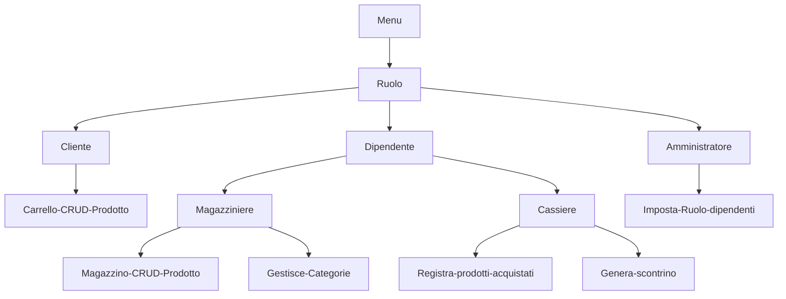

# SUPERMERCATO ADVANCED

Implementare le entità che compongono il supermercato.

> Partendo dalla soluzione dell'esercizio `28_classi-9` implementare le seguenti entità:
- **Dipendente**: rappresenta un dipendente del supermercato.

> Oltre ai campi già presenti (ID,nome,cognome), aggiugere un campo `ruolo` di tipo `String` che rappresenta il ruolo del dipendente (es."cassiere","magazziniere","direttore",ecc.). Implementare i metodi `getRuolo` e `setRuolo`.

1. **Cassiere**: può registrare i prodotti acquistati da un cliente e calcolare il totale da pagare.
2. **Magazziniere**: può aggiungere o rimuovere prodotti dal magazzino.
3. **Amministratore**: rappresenta un amministratore del supermercato. Un amministratore è un dipendente con ruolo "amministratore".
Può impostare il ruolo dei dipendenti. Implementare il metodo `setRuolo` che accetta come parametri un dipendente e una stringa rappresentante il ruolo da assegnare al dipendente.

| Dipendente| Tipo di dato | Note
|-----------|-----------|-----------|
| ID | int | viene generato in automatico con un progressivo
| username | string | viene assegnato all'admin  
| ruolo | String | viene assegnato all'admin e può essere cassiere o magazziniere

|Cliente| Tipo di dato | Note 
|-----------|-----------|-----------|
| ID | int | viene generato in automatico con un progressivo
| username | string | ognuno decide come vuole farlo
| carrello | Prodotto[] | 
| storico acquisti | Purchases[] | viene popolato al termine di ogni acquisto
| percentuale_sconto | int | viene incrementata a seconda del valore dello storico degli acquuisti
| credito | double | 

|Prodotto| Tipo di dato | Note 
|-----------|-----------|-----------|
| ID | int | viene generato in automatico con un progressivo
| nome | string | viene inserito dal magazziniere
| prezzo | double | viene inserito dal magazziniere
| quantità | int | viene inserito dal magazziniere
| categoria | string | viene inserito dal magazziniere

|Categoria| Tipo di dato | Note 
|-----------|-----------|-----------|
| ID | int | viene generato in automatico con un progressivo
| nome | string | 

**Purchases è lo stato nel quale si trova l'acquisto di un cliente. Prima di essere passato alla cassa**
- Quando viene passato allo stato `completato` la cassa può processare lo scontrino.

|Purchases| Tipo di dato | Note 
|-----------|-----------|-----------|
| ID | int | viene generato in automatico con un progressivo
| cliente | Cliente | ognuno decide come vuole farlo
| prodotti | Prodotto[] | 
|quantità| int |
| data | Date | 
| stato | Bool |  Lo stato di un acquisto di default è `in corso` e può essere modificato dal cliente in `completato` o `annullato`

|Cassa| Tipo di dato | Note 
|-----------|-----------|-----------|
| ID | int | viene generato in automatico con un progressivo
| dipendente | Dipendente | ognuno decide come vuole farlo
| acquisti | Purchases[] | 
| scontrino_processato | Bool | di default è `false` e diventa `true` quando la cassa ha processato lo scontrino e può ricaricare il credito del cliente quando è finito

Ruoli:

|Cassiere|Magazziniere | Amministratore | Cliente 
|-----------|-----------|-----------|-----------|
| può registrare i prodotti acquistati da un cliente che ha degli acquisti in stato completato e calcolare il totale da pagare generando lo scontrino.| può visualizzare aggiungere modificare o rimuovere prodotti dal magazzino e può gestire le categorie. | può visualizzare ed impostare il ruolo dei dipendenti. | Può aggiungere o rimuovere prodotti e cambiare lo stato dell'ordine

# Grafico che rappresenta il programma del ciclo di vita del prodotto

